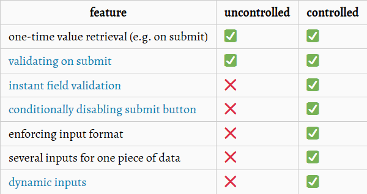

# React

## General

The ```react``` package holds the react source for components, state, props and all the code that is react.

The ```react-dom``` package as the name implies is the glue between React and the DOM. Often, you will only use it for one single thing: mounting your application to the index.html file with ReactDOM.render().

The reason **React** and **ReactDOM** were split into two libraries was due to the arrival of ```React Native``` (a react platform for mobile development).

React components are such a great way to organize UI that it has now spread to mobile to react is used in web and in mobile. react-dom is used only in web apps.

```render``` method gets called anytime the component gets updated. And functionality should not be put here, because if this method updates the component it's going to call itself by default again, causing an endless loop.

```Babel``` is a toolchain that is mainly used to convert ECMAScript 2015+ code into a backwards compatible version of JavaScript in current and older browsers or environments.

We don't need an explicitly defined ```constructor``` unless we need to reference the props in our initial state object.

To call a method we need to call it without the parentheses such as **this.someMethod** instead of **this.someMethod()** because the later would get called everytime the component gets rendered during, e.g. **onChange**.

## Properties

```Props``` is a system for passing data from a **parent** component to a **child** component, the goal is to customize or configure a child component.

    <AppComponent>
        <some JSX>
    </AppComponent>

To access **some JSX**, we need to call ```props.children``` or for just the general **props** we do ```props.author```

It is also possible to set ```default props```:

    SomeComponent.defaultProps = {
        message: 'Loading...'
    };

## Class-Based Components

**Functional** components - good for simple content

**Class** components - good for just abut everything else:
* Easier code organisation
* Can use 'state' (another React system)
    * Easier to handle user input
* Understands lifecycle events
    * Easier to do things when the app first starts

## State

```State``` - is a JS object that contains data relevant to a component. Only usable with class component and updating it on a component causes the component to (almost) instantly to re-render.

It has to be initialised when a component is created and it can only be updated using the function **setState()**.

## Lifecycle Methods

```Lifecycle methods``` are functions that are called during very distinct or discrete times during that cycle.

```componentDidMount``` - called one time when our component first gets rendered onto the screen. We can put some amount of code inside to set up or do some initial data loading or do some initial data loading or a wide variety of different operations that we might want to do once the component gets rendered for the first time. Recommended that _data loading_ gets done here instead of the constructor.

```componentDidUpdate``` - gets called anytime automatically once the component gets updated.

```componentWillUnmount``` - this methods is invoked immediately before a component is unmounted and destroyed. Perform any necessary cleanup in this method, such as invalidating timers, canceling network requests, or cleaning up any subscriptions that were created in **componentDidMount**.

## Controlled vs Uncontrolled Components

* A ```Controlled``` Component is one that takes its current value through props and notifies changes through callbacks like onChange. A parent component "controls" it by handling the callback and managing its own state and passing the new values as props to the controlled component. You could also call this a "dumb component". The **value** property is set by **React** everytime the element gets rendered.
    * Good for cases like when we need to clear the **value**, so instead of calling the **DOM** directly, we can just clear the **state** and the component will be re-rendered with an empty value.

* A ```Uncontrolled``` Component is one that stores its own state internally, and you query the DOM using a ref to find its current value when you need it. This is a bit more like traditional HTML.




## Refs

React DOM ```Refs``` give access to a single DOM element, by creating refs in the constructor, assign them to isnstance variables, then pass to a particular JSX element as props.

```js
class SomeComponent extends React.Component {
    constructor(props) {
        super(props);

        this.compRef = React.createRef();
    }

    render() {
        return (
            <div ref={this.compRef}></div>
        );
    }
}
```

# Styling

* ```semantic-ui```
* ```bootstrap```

React doesn't automatically scan over all the CSS files to include them, we need to include them in the component or the **index.html** file.

# ECMAScript 6

If you forget to add a **return** keyword it will return **undefined** by default and the expression will become **false**.

## forEach

```js
let numbers = [1,2,3,4,5];
let total = 0;

// #1
numbers.forEach(v => total += v);

// #2
function adder(number) {
    total += number;
}
numbers.forEach(adder);
```

## map

```map``` is the same as ```forEach``` but also returns a new value. In summary, use **map** when we want to mutate data.

## filter

Used for any type of list filtering.

```js
let products = [
    { name: 'cucumber', type: 'vegetable' },
    { name: 'banana', type: 'fruit' },
    { name: 'celery', type: 'vegetable' },
    { name: 'orange', type: 'fruit' }
];

let filteredProducts = products.filter(v => v.type === 'fruit');
```

## find

Look for a specific element in an array. Quite similar to ```filter``` but instead of getting all matches, we only look for the first one.

```js
let users = [
    { name: 'Jill' },
    { name: 'Alex' },
    { name: 'Bill' }
];

let user = users.find(v => v.name === 'Alex');
```

## every

Check if all elements apply to some logic.

```js
let computers = [
    { name: 'Apple', ram: 24 },
    { name: 'Compaq', ram: 4 },
    { name: 'Acer', ram: 32 }
];

let computersCanRun = computers.every(v => v.ram > 5);
```

## some

Similar to ```every```, but only checks if at least ```some``` of the elements fall under a category.

## reduce

The ```reduce``` method executes a reducer function (that we provide) on each element of the array resulting in a single output value.

```js
array.reduce((initialValue, valueFromArray) => {
    return initialValue + valueFromArray
}, initialValue);
```

```js
function balancedParentheses(string) {
    return !string.split("").reduce((previous, char) => {
        if (previous < 0) return previous;
        if (char === "(") return ++previous;
        if (char === ")") return --previous;
        
        return previous;
    }, 0);
}

balancedParentheses("()()()");
```

## Rest and Spread operator

The ```rest```/```spread``` parameter syntax allows us to represent an indefinite number of arguments as an array and unpack them.

```js
const numbers = [1,2,3,4,5];
const letters = ['a','b','c','d','e'];

const combined = [...numbers, ...letters];
// [a,2,3,4,5,a,b,c,d,e]
// the same as *args in python
```

## Destructuring

The ```destructuring``` assignment syntax is a JavaScript expression that makes it possible to unpack values from arrays, or properties from objects, into distinct variables. Destructuring a non-existant object will result in it being **undefined**.

```js
// named arguments
const expenses = {
    type: 'Business',
    amount: 129
};
const {type, amount} = expense;
```

```js
// by order
const companies = [
    'Google',
    'Facebook',
    'Uber'
];
const [name, name2, name3] = companies;
```

Destructuring **objects** and **arrays** at the same time:

```js
const Google = {
    locations: ['Mountain View', 'New York', 'London']
};
const { locations: [ location ] } = Google;
// destructures the locations and takes the first element from the array
```

Another good example in reformating data:

```js
const points = [
    [4, 5],
    [10, 1],
    [0, 40]
];
points.map(([x, y]) => ({ x: x, y: y }));
```

## Classes

```js
class Car extends OtherObject{
    constructor({ title }) {
        //OtherObject constructor
        super();

        this.title = title;
    }

    drive() {
        return 'vroom';
    }
}

const car = new Car({ title: 'Toyota' });
```

## Generators

```Generators``` are functions which can be exited and later re-entered. Their context (variable bindings) will be saved across re-entrances. Calling a generator function does not execute its body immediately; an iterator object for the function is returned instead.

```js
function* numbers() {
    const newValue = yield 'oldValue';
    return newValue;
}

const gen = numbers();
gen.next();
gen.next('newest');
// Object { value: oldValue, done: false }
// Object { value: newest, done: true }
```